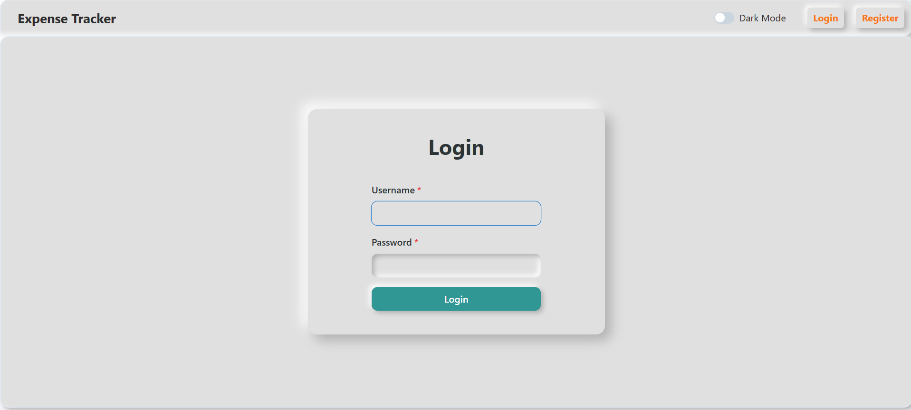
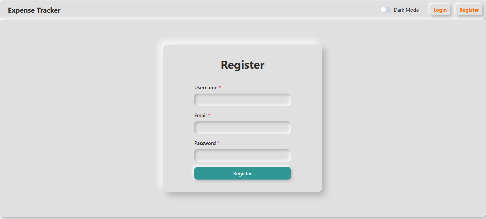
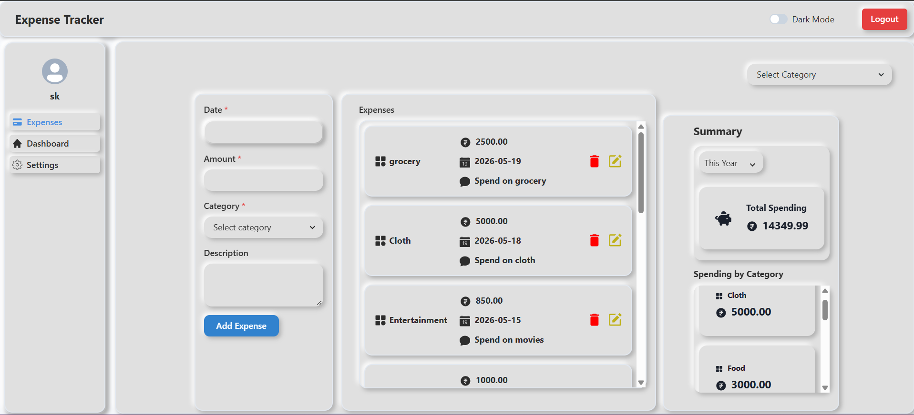
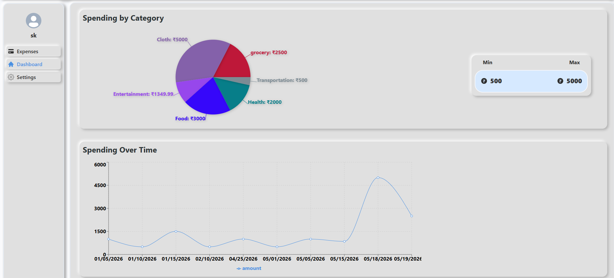

# 💸 Expense Tracker

> A full-stack personal finance management application to track, visualize, and analyze your daily spending — built with a clean and insightful data dashboards.

<br/>

## 📸 Screenshots

| Login                                       | Register                                          |
| ------------------------------------------- | ------------------------------------------------- |
|  |  |

| Expenses                                | Dashboard                                 |
| --------------------------------------- | ----------------------------------------- |
|  |  |

<br/>

## ✨ Features

**Authentication**

- Secure user registration with username, email, and password
- JWT-based login/logout flow
- Protected routes — unauthenticated users are redirected to login

**Expense Management**

- Add expenses with date, amount, category, and optional description
- Edit or delete any expense inline
- Filter expenses by category using a dropdown
- Scrollable expense list with per-entry breakdown

**Summary Panel**

- Real-time total spending aggregation
- Spending breakdown by category (Cloth, Food, Grocery, Health, etc.)
- Toggle between time ranges — _This Year_, _This Month_, _This Week_,_Today_

**Dashboard & Analytics**

- Interactive **pie chart** for spending distribution by category
- **Line chart** showing spending trends over time
- Adjustable **Min / Max** filter to zoom in on specific spending ranges

**UI/UX**

- Dark mode toggle — persisted across sessions
- collapsible sidebar
- Clean neumorphic card design for a polished feel

<br/>

## Tech Stack

| Layer            | Technology             |
| ---------------- | ---------------------- |
| Frontend         | React.js, Recharts     |
| Styling          | Chakra-Ui/components   |
| State Management | React Context API      |
| Backend          | Node.js, Express.js    |
| Database         | MongoDB (Mongoose ODM) |
| Auth             | JWT + bcrypt           |
| Build Tool       | Vite                   |

<br/>

## 🚀 Getting Started

### Prerequisites

Make sure you have the following installed:

- [Node.js](https://nodejs.org/) v18+
- [npm](https://www.npmjs.com/) or [yarn](https://yarnpkg.com/)
- [MongoDB](https://www.mongodb.com/) (local or Atlas URI)

### Installation

```bash
# 1. Clone the repository
git clone https://github.com/skrm05/mern-personal-expense-tracker-main.git
cd expense-tracker

# 2. Install dependencies for both client and server
npm install
cd client && npm install && cd ..

# 3. Set up environment variables
cp .env.example .env
```

### Environment Variables

Create a `.env` file in the root directory:

```env
# Server
PORT=5000
CORS_ORIGINS= http://localhost:5173

# MongoDB
MONGO_URL=mongodb://localhost:27017/expense-tracker

# JWT
JWT_Secret=your_super_secret_key

```

### Running the App

```bash
# Run both client and server concurrently
npm run dev

# Run server only
npm run server

# Run client only
npm run dev
```

Open [http://localhost:5173](http://localhost:5173) in your browser.

<br/>

## 📡 API Reference

| Method   | Endpoint            | Description                        | Auth Required |
| -------- | ------------------- | ---------------------------------- | :-----------: |
| `POST`   | `/register`         | Register a new user                |      ❌       |
| `POST`   | `/login`            | Login and receive JWT              |      ❌       |
| `GET`    | `/expenses`         | Get all expenses for the user      |      ✅       |
| `POST`   | `/expenses`         | Create a new expense               |      ✅       |
| `PUT`    | `/expenses/:id`     | Update an existing expense         |      ✅       |
| `DELETE` | `/expenses/:id`     | Delete an expense                  |      ✅       |
| `GET`    | `/expenses/summary` | Get category-wise spending summary |      ✅       |

<br/>

<br/>

## 📦 Build for Production

```bash
# Build the React client
cd client && npm run build

# Start the production server
NODE_ENV=production npm start
```

<br/>

## 🔐 Security Highlights

- Passwords hashed with **bcrypt** (salt rounds: 12)
- All expense endpoints protected by **JWT middleware**
- Input validation and sanitization on every route
- CORS configured to allow only trusted origins
- Environment secrets never committed to version control

<br/>

## 🤝 Contributing

Contributions are welcome! Here's how to get started:

```bash
# 1. Fork the repository
# 2. Create a feature branch
git checkout -b feature/your-feature-name

# 3. Commit your changes (follow Conventional Commits)
git commit -m "feat: add budget alert notifications"

# 4. Push to your branch and open a Pull Request
git push origin feature/your-feature-name
```

Please make sure your code:

- Passes all existing tests
- Follows the ESLint configuration
- Includes tests for new functionality
- Updates documentation if needed

<br/>

## 📄 License

This project is licensed under the [MIT License](./LICENSE).

<br/>

## 👤 Author

**SK**

- GitHub: [@skrm05](https://github.com/skrm05)
- LinkedIn: [sanjaykrm](linkedin.com/in/sanjaykrm)

<br/>

---

<p align="center">
  If you found this project helpful, please consider giving it a ⭐ — it helps others discover it!
</p>
